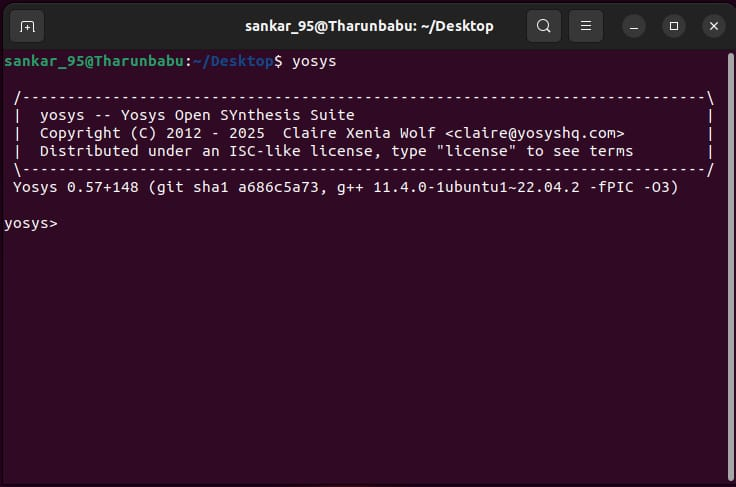

# 🚀 Digital VLSI SoC Design and Planning — Task 1

---

## 📖 Introduction  
This summary walks through the **Digital VLSI SoC (System-on-Chip) design and planning process**.  
It covers the journey from **chip modeling** to **final SoC integration**, along with verification and key takeaways for practical applications.  

---

## 🔧 Step 1: Chip Modeling (O1)  
- Starts with **system specifications** using a C model.  
- Functionality validated with a **C testbench**.  
- Goal → verify correctness of design intent before RTL coding.  

---

## 🖥️ Step 2: RTL Architecture (O2)  
- System described in **RTL (Verilog)** — the digital form of hardware.  
- Design broken down into:  
  - 🧠 Processor  
  - 🔌 Peripherals / IP cores  
- RTL is tested to ensure behavior matches the original specification.  

---

## 🏗️ Step 3: Synthesis & Netlist Generation  
- RTL synthesized into a **Gate-Level Netlist (GLN)**.  
- Outputs include:  
  - ✅ Gate-Level Netlist  
  - ✅ Synthesized macros  
  - ✅ Functional analog IP models  

---

## 🛠️ Step 4: SoC Integration (O3)  
- Processor, peripherals, and IPs brought together into a **System-on-Chip**.  
- Key activities:  
  - 📐 Floorplanning  
  - ⏱️ Clock Tree Synthesis (CTS)  
  - 🧩 Placement & Routing  
- Hardened macros + analog libraries added.  
- Final product: **GDSII file** for fabrication.  

---

## 🔍 Step 5: Physical Verification  
- 📝 **Design Rule Check (DRC):** ensures manufacturing rules are followed.  
- 🧾 **Layout vs Schematic (LVS):** confirms physical layout matches schematic.  

---

## 🎯 Step 6: Final SoC (O4)  
- Operating frequency: **10 MHz – 130 MHz**.  
- Modular SoC design allows reuse for multiple applications:  
  - ⌚ Smartwatches  
  - ⚡ Arduino-based projects  
  - 📺 TV panels  
  - ❄️ AC controllers  

---

## 🗝️ Key Points  
> **Flow Recap:**  
> Specifications → RTL → Synthesis → SoC Integration → Verification → Final Chip ✅  

- Verification is performed at **every stage**.  
- Modular design = **reuse + flexibility**.  
- Enables real-world adaptation across diverse applications.  

---

## ✍️ Contributor  
**Tharun Babu V**  

---


# VSD Tools Setup & Installation

This document describes the installation process for open-source tools used in VLSI design. Each section provides commands, verification steps, and space for screenshots.

---

## 1. System Requirements

- **Operating System:** Ubuntu 20.04 LTS or newer  
- **RAM:** Minimum 6 GB (8 GB recommended)  
- **Disk Space:** 50 GB free  
- **Processor:** 4 cores or more  

---

## 2. Tools Covered

- Yosys (Synthesis)  
- Icarus Verilog (Simulation)  
- GTKWave (Waveform Viewer)  
- NGSpice (Circuit Simulation)  
- Magic VLSI (Layout Design)  

---

## A. Yosys – RTL Synthesis

```bash
git clone https://github.com/YosysHQ/yosys.git
cd yosys
sudo apt install make
sudo apt-get install build-essential clang bison flex    libreadline-dev gawk tcl-dev libffi-dev git    graphviz xdot pkg-config python3 libboost-system-dev    libboost-python-dev libboost-filesystem-dev zlib1g-dev
make config-gcc
git submodule update --init --recursive
make
sudo make install
```

**Verification:**  
```bash
yosys
```



---

## B. Iverilog – Verilog Simulation

```bash
sudo apt-get install iverilog
```

**Verification:**  
```bash
iverilog
```

📸 *[Insert Iverilog Screenshot Here]*  

---

## C. GTKWave – Waveform Viewer

```bash
sudo apt update
sudo apt install gtkwave
```

**Verification:**  
```bash
gtkwave
```

📸 *[Insert GTKWave Screenshot Here]*  

---

## D. NGSpice – Circuit Simulator

```bash
tar -zxvf ngspice-37.tar.gz
cd ngspice-37
mkdir release && cd release
../configure --with-x --with-readline=yes --disable-debug
make
sudo make install
```

**Verification:**  
```bash
ngspice
```

📸 *[Insert NGSpice Screenshot Here]*  

---

## E. Magic VLSI – Layout Tool

```bash
sudo apt-get install m4 tcsh csh libx11-dev tcl-dev tk-dev    libcairo2-dev mesa-common-dev libglu1-mesa-dev libncurses-dev
git clone https://github.com/RTimothyEdwards/magic
cd magic
./configure
make
sudo make install
```

**Verification:**  
```bash
magic
```

📸 *[Insert Magic Screenshot Here]*  

---

## 3. Version Checks

Run these commands to confirm tool versions:

```bash
git --version
docker --version
python3 --version
python3 -m pip --version
make --version
```

📸 *[Insert Version Screenshot Here]*  

---

## 4. Installation Summary

| Tool       | Status   | Purpose            |
|------------|----------|--------------------|
| Yosys      | ✅ Done  | RTL Synthesis      |
| Iverilog   | ✅ Done  | Verilog Simulation |
| GTKWave    | ✅ Done  | Waveform Debugging |
| NGSpice    | ✅ Done  | Circuit Simulation |
| Magic VLSI | ✅ Done  | Layout Design      |
| Versions   | ✅ Done  | Environment Check  |

---

## Credits

- **Contributor:** Tharun Babu V  
- **Program:** VLSI System Design (VSD)  
